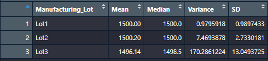
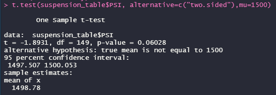
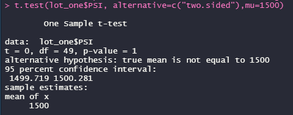
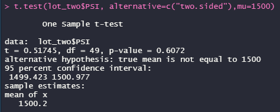
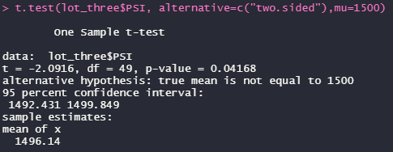

# MechaCar_Statistical_Analysis   

## Linear Regression to Predict MPG   

To begin the analysis of which vehicle design specifications impacted miles per gallon most for the new MechaCar prototype, I utilized R's lm() function to create a statistics summary table. I used miles per gallon (mpg) as my dependent variable, and all other data columns as my independent variables.   

  
*Figure 1: Code snippet displaying the resulting p-values and r-squared values for my linear regression model.*   

Few bits of information to take away from the figure above:  

- Intercept, vehicle length, and ground clearance proved to be non-random amounts of variance because their p-values were less than 0.05. This rejects the null hypothesis that mpg is unaffected by other factors and is due to random chance.   

- Slope is not zero because the p-value of the whole summary is less than 0.05, which rejects the null hypothesis that the line would be equal to zero.   

- This chart is effective because the r-squared value is 0.7149 meaning the coefficient of determination is greater than 0.7. A great way to visualize this is by stating roughly 71.5% of points on a scatter plot would land on the line of best fit (linear regression). Another supporting factor is the p-value being less than 0.05 showing an overall relationship.   

## Summary Statistics on Suspension Coils   

My goal was to determine whether the design for the MechaCar suspension coils were meeting company standards. To do this I relied on R to create a couple statistic summary tables from the data provided.   

  
*Table 1: Table displaying mean, median, variance, and standard deviation of suspension coil's PSI data that was collected.*   

  
*Table 2: Mean, median, variance, and standard deviation of suspension coil's PSI based on manufacturing lot number.*   

MechaCar's design specifications dictated that suspension coils variance must not exceed 100 pounds per square inch. Looking at the tables above, it's clear that overall the suspension coils met design specifications. However, once broken down into their manufacturer lot numbers, we can see that Lots 1 and 2 meet design specifications, but Lot 3 does not.   

## T-Tests on Suspension Coils   

Ran t-tests on lot numbers as a whole as well as each seperately. In conclusion, all p-values were greater than 0.05 meaning that the means were not statistically different EXCEPT for lot three. See below.    

  
*Figure 2: T-Test of all lot numbers together.*   

  
*Figure 3: T-Test of lot one.*   

  
*Figure 4: T-Test of lot two.*   

  
*Figure 5: T-Test of lot three. P-value less than 0.05!*   

