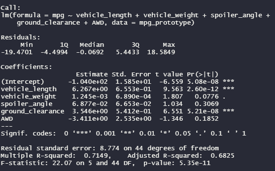

# MechaCar_Statistical_Analysis   

## Linear Regression to Predict MPG   

To begin the analysis of which vehicle design specifications impacted miles per gallon most for the new MechaCar prototype, I utilized R's lm() function to create a statistics summary table. I used miles per gallon (mpg) as my dependent variable, and all other data columns as my independent variables.   

  
*Figure 1: Code snippet displaying the resulting p-values and r-squared values for my linear regression model.*   

Few bits of information to take away from the figure above:  

- Intercept, vehicle length, and ground clearance proved to be non-random amounts of variance because their p-values were less than 0.05. This rejects the null hypothesis that mpg is unaffected by other factors and is due to random chance.   

- Slope is not zero because the p-value of the whole summary is less than 0.05, which rejects the null hypothesis that the line would be equal to zero.   

- This chart is effective because the r-squared value is 0.7149 meaning the coefficient of determination is greater than 0.7. A great way to visualize this is by stating roughly 71.5% of points on a scatter plot would land on the line of best fit (linear regression). Another supporting factor is the p-value being less than 0.05 showing an overall relationship.   

